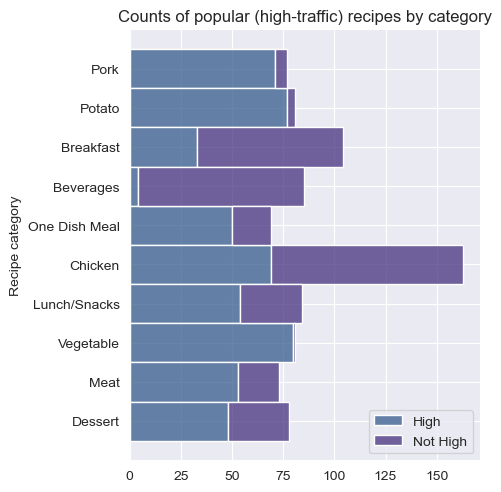

# Recipe-Website-Traffic-Prediction (Project Summary)

## Context
A (fictional) recipe website called "Tasty Bytes" features 1 recipe each day on its homepage. The featured recipe's Product Manager discovered that certain popular recipes being featured on the homepage can cause as much as a 40% increase in traffic to the rest of the website. 

Given previous data on the featured recipes, develop a model to predict which recipes will be ''popular''; that is, which recipes will lead to an increase in traffic. The product manager has expressed that they would like these predictions to be correct at least 80% of the time. 

## Data
All data from the previously featured recipes can be found in the client-provided file `recipe_site_traffic_2212.csv`. It contains 947 rows, with the following columns:

|Column       |Data Type        |Description   |
|-------------|-----------------|--------------|
|`recipe`     |Numeric (integer)| Unique identifier for the recipe. |
|`calories`   |Numeric (float)  | Number of calories in the recipe. |
|`carbohydrate`|Numeric (float) | Amount of carbohydrates (grams) in the recipe.|
|`sugar`      |Numeric (float)  | Amount of sugar (grams) in the recipe.|
|`protein`    |Numeric (float)  | Amount of protein (grams) in the recipe.|
|`category`   |Object (string)  | Recipe category. Ten possible values: Lunch/Snacks, Breakfast, Chicken, Meat, Dessert, Vegetable, Pork, Potato, Beverages, One Dish Meal|
|`servings`   |Numeric (integer)| Number of servings in the recipe.|
|`high_traffic`|Object (string) | Target variable. A value of 'High' indicates high traffic; left blank otherwise.|

## Results
After initial analysis of the data, it seems that the recipe's category is the most significant predictor of whether a recipe will be high-popularity, with other features present but less emphasized:

Successfully developed two predictive models, both of which perform at or above the requested level (correct high-traffic predictions at least 80% of the time). Of these two models, the first (logistic regression) performs marginally better than the second (decision tree).
- **Model Metric:** Precision
- **KPI:** High-Traffic Per Year (HTPY), or the number of days in a year with higher than normal web traffic.
    - Current practice is expected to yield 222.65 HTPY, based on the current success rate in choosing a high-traffic recipe. 
    - The predictive models are expected to yield 302.95 HTPY and 299.3 HTPY for the logistic and decision tree models, respectively. 
    - Employing a predictive model has potential to **increase HTPY by up to 36%**.

We recommend the following actions:
- **Model Deployment:** Deploy the logistic regression model into production.
    - This recommendation assumes that recipe nutrition information is collected at or above the current frequency.
    - Long-term, if recipes continually have no nutritional information attached, the other (decision tree) model would likely out-perform the logistic regression model, as it places less importance on these features. 
- **Experimentation:** Perform an A/B test to determine the real-world impact of the model prediction.
    - Split users into two random groups, one control group and one experimental group.
    - Feature recipes as normal for the control groups, and feature recipes recommended by the model for the experimental group.
    - A lower-than-predicted difference between the two groups is indicative that the model needs to be re-evaluated, or there are factors impacting high traffic than just the featured recipe's selection. 
- **Tuning and Future Data Collection:** Expand the number of features for data points and re-train / re-evaluate the model.
    - It is possible that unseen features impact whether a recipe is popular or not. 
    - Examples:
        - Date: Holidays and other seasonal events may make one category more popular than usual (such as desserts near end-of-year holidays).
        - Day of week: Certain days of the week may make one category more popular than usual (such as one dish meals during the work week).
        - Time: Total time (minutes) to cook a recipe. Quick meals may be more likely to be popular during busy times of the day/week/year.